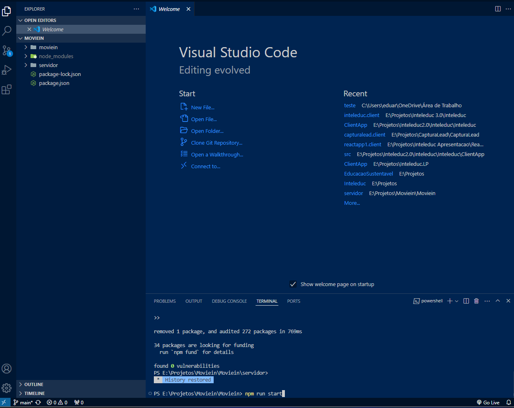

# Moviein

## Introdução
Moviein é um projeto da faculdade para streaming de filmes e vídeos. Para que esse projeto seja realizado, necessitava de uma estrutura e montagem dos projetos **Backend** e **Frontend**, além da construção do modelo e elaboração do **Banco de dados**.

---

## Estrutura do projeto
O projeto em construção é feita por dois projetos **nodejs**(moviein), uma em React typescript que é o client do sistema e o outro o **servidor**(servidor), responsável pelo **backend** e pela api(endpoints).

Abaixo mostra a montagem final das pastas após o clone do repositório do projeto, como pode ver, o projeto mostra as duas pastas citadas anteriormente e o node_modules e packages.

*(observação): Os projetos **moviein** e **servidor** possuem seus próprios diretórios **node_modules** para o funcionamento individual. Além disso, o diretório **node_modules** mostrado abaixo serve para rodar ambos os projetos simultaneamente.*


## Inicialização / 'Run' do projeto
Após o clone do projeto pelo Github, é necessário fazer algumas coisas para o funcionamento do projeto. 

### 1. Pré requisito
- Seu computador com o Nodejs (de preferência igual ou superior a **v20.11.0**)
  - link do site: https://nodejs.org/en 

### 2. npm install 
É necessário executar o seguinte código para os respectivos projetos. São esses caminhos:
- /Moviein/Moviein/moviein
- /Moviein/Moviein/
- /Moviein/Moviein/servidor

esse é o código para a execução para cada um:
```bash
npm install
```

---

# Iniciar projeto
Na rota '/Moviein', execute o __npm run start__

Após clicar em enter para iniciar o processo, o sistema irá iniciar tanto o **servidor(backend)** quanto o **moviein(frontent)**.


E rodando, o sistema irá abrir no navegador o site executado no localhost:3000 no moviein e no servidor no localhost:3001


